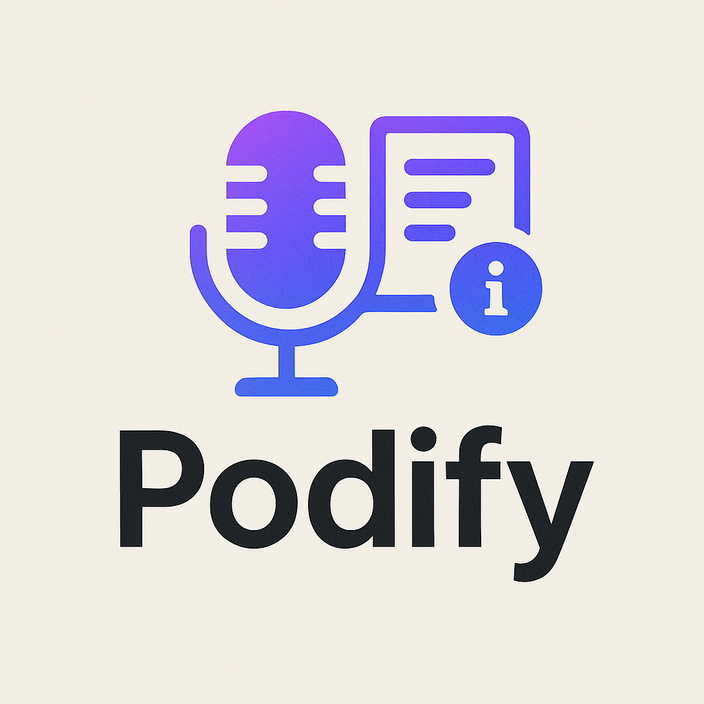

# podify

AI-driven podcast generator that transforms any user-requested topic into a fully produced episode by gathering and verifying content from reliable sources (Wikipedia, scientifi papers, web searches) and structuring it into a coherent script. 