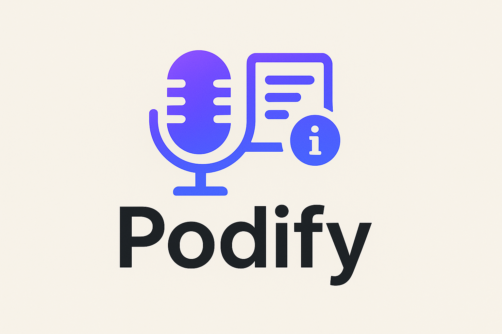

# Podify 🎙️



**AI-driven podcast generator that transforms any user-requested topic into a fully produced episode by gathering and verifying content from reliable sources (Wikipedia, scientific papers, web searches) and structuring it into a coherent, engaging podcast script.**

## 🌟 Features

- **Multi-Source Research**: Automatically gathers information from Wikipedia, arXiv, PubMed, Semantic Scholar, and web searches
- **AI-Powered Content Organization**: Uses advanced LLMs to structure and organize research into coherent narratives
- **Professional Podcast Generation**: Creates engaging, conversational podcast scripts with natural flow
- **Text-to-Speech Integration**: Converts scripts to high-quality audio using ElevenLabs
- **RESTful API**: Easy-to-use FastAPI endpoints for integration
- **Configurable Research Tools**: Flexible research pipeline with multiple academic and web sources

## 🏗️ Architecture

Podify uses a sophisticated multi-stage pipeline built with LangGraph:

1. **Retriever Node**: Expands the user's topic and coordinates research across multiple sources
2. **Research Tools**: Parallel execution of various research tools (Wikipedia, arXiv, PubMed, etc.)
3. **Organizer Node**: Structures and cleans the gathered research content
4. **Podcaster Node**: Transforms organized content into engaging podcast scripts
5. **Audio Generation**: Converts scripts to professional-quality audio

    

## 🚀 Quick Start

### Prerequisites

- Python 3.10+
- API keys for:
  - OpenAI (for LLM processing)
  - Anthropic (alternative LLM provider)
  - Tavily (web search)
  - ElevenLabs (text-to-speech)
  - LangSmith (optional, for tracing)

### Installation

1. **Clone the repository**
   ```bash
   git clone https://github.com/myrkuur/podify
   cd podify
   ```

2. **Install dependencies**
   ```bash
   pip install -r requirements.txt
   ```
   or alternatively you could use `uv`:
   ```bash
   pip install uv
   uv sync
   ```

3. **Set up environment variables**
   ```bash
   cp .env.sample .env
   ```
   
   Edit `.env` and add your API keys:
   ```env
   OPENAI_API_KEY=your_openai_key_here
   ANTHROPIC_API_KEY=your_anthropic_key_here
   TAVILY_API_KEY=your_tavily_key_here
   ELEVENLABS_API_KEY=your_elevenlabs_key_here
   
   # Optional: LangSmith for tracing
   LANGSMITH_TRACING=true
   LANGSMITH_ENDPOINT=https://api.smith.langchain.com
   LANGSMITH_API_KEY=your_langsmith_key_here
   LANGSMITH_PROJECT=podify
   ```

4. **Create output directory**
   ```bash
   mkdir -p output
   ```

5. **Start the server**
   ```bash
   uvicorn app.main:app --env-file .env
   ```
   or (if you setup `uv`):
   ```bash
   uv run uvicorn app.main:app --env-file .env
   ```

The API will be available at `http://localhost:8000`

## 📖 Usage

### API Endpoints

#### Generate Transcript Only
```bash
POST /generate_transcript
```

**Request Body:**
```json
{
  "topic": "The history of artificial intelligence"
}
```

**Response:**
```json
{
  "topic": "The history of artificial intelligence",
  "cleaned_content": "Organized research content...",
  "transcript": "Welcome to today's episode where we explore..."
}
```

#### Generate Full Podcast (Transcript + Audio)
```bash
POST /generate_podcast
```

**Request Body:**
```json
{
  "topic": "World War I"
}
```

**Response:**
```json
{
  "topic": "World War I",
  "cleaned_content": "Organized research content...",
  "transcript": "Picture this: It's a beautiful summer morning...",
  "podcast": "output/abc123def456.mp3"
}
```

### Example Usage with cURL

```bash
# Generate transcript only
curl -X POST "http://localhost:8000/generate_transcript" \
     -H "Content-Type: application/json" \
     -d '{"topic": "The evolution of human language"}'

# Generate full podcast
curl -X POST "http://localhost:8000/generate_podcast" \
     -H "Content-Type: application/json" \
     -d '{"topic": "Climate change and renewable energy"}'
```

## 🔧 Configuration

### Research Tools

The system includes several research tools that can be configured:

- **Web Search (Tavily)**: Configurable search depth and time range
- **Wikipedia**: Comprehensive encyclopedia searches
- **arXiv**: Academic papers and preprints
- **PubMed**: Medical and life science literature
- **Semantic Scholar**: Computer science and academic papers

### LLM Configuration

The system supports multiple LLM providers:
- **OpenAI**: GPT models for routing
- **Anthropic**: Claude models for content generation

### Audio Configuration

ElevenLabs integration provides:
- High-quality voice synthesis
- Multiple voice options
- Configurable audio formats (MP3, WAV)

## 📁 Project Structure

```
podify/
├── app/                    # Main application code
│   ├── __init__.py        # App initialization and LLM setup
│   ├── main.py            # FastAPI application and endpoints
│   ├── models.py          # Pydantic models for state management
│   ├── nodes.py           # LangGraph processing nodes
│   ├── prompt.py          # System prompts for different stages
│   └── utils.py           # Utility functions (TTS, etc.)
├── tools/                 # Research tools and integrations
│   ├── __init__.py        # Tools initialization
│   ├── researchers.py     # Research tool implementations
│   └── audio_editors.py   # Audio processing tools
├── example/               # Sample outputs
│   ├── WW1.txt           # World War I podcast transcript
│   ├── what happened in WW2.txt
│   └── history of human evolution.txt
├── images/                # Visual assets
│   ├── banner.png         # Project banner
│   ├── logo.png          # Project logo
│   └── graph.png         # Architecture diagram
├── output/                # Generated audio files
├── db/                    # Database files (if any)
├── requirements.txt       # Python dependencies
├── .env.sample           # Environment variables template
└── README.md             # This file
```

## 🎯 Example Topics

The system works well with a wide variety of topics:

- **Historical Events**: "World War I", "The Renaissance", "Ancient Rome"
- **Scientific Concepts**: "Quantum mechanics", "Evolution", "Climate change"
- **Technology**: "History of the internet", "Artificial intelligence", "Space exploration"
- **Cultural Topics**: "Jazz music history", "Philosophy of ethics", "World religions"

## 🎨 Customization

### Modifying Prompts

Edit `app/prompt.py` to customize:
- Research expansion strategies
- Content organization approaches
- Podcast style and tone
- Narrative structure

### Adding Research Tools

Extend `tools/researchers.py` to add new research sources:

```python
def new_research_tool():
    # Implement your custom research tool
    return tool_instance
```

## 📄 License

This project is licensed under the MIT License - see the LICENSE file for details.

## 🙏 Acknowledgments

- **LangChain/LangGraph**: For the powerful AI orchestration framework
- **OpenAI/Anthropic**: For advanced language models
- **ElevenLabs**: For high-quality text-to-speech
- **Tavily**: For intelligent web search capabilities
- **Academic APIs**: Wikipedia, arXiv, PubMed, Semantic Scholar for research access

## 📞 Support

For questions, issues, or feature requests:
- Open an issue on GitHub
- Check existing documentation
- Review example outputs in the `example/` directory

---

**Transform any topic into an engaging podcast with the power of AI! 🎙️✨**
